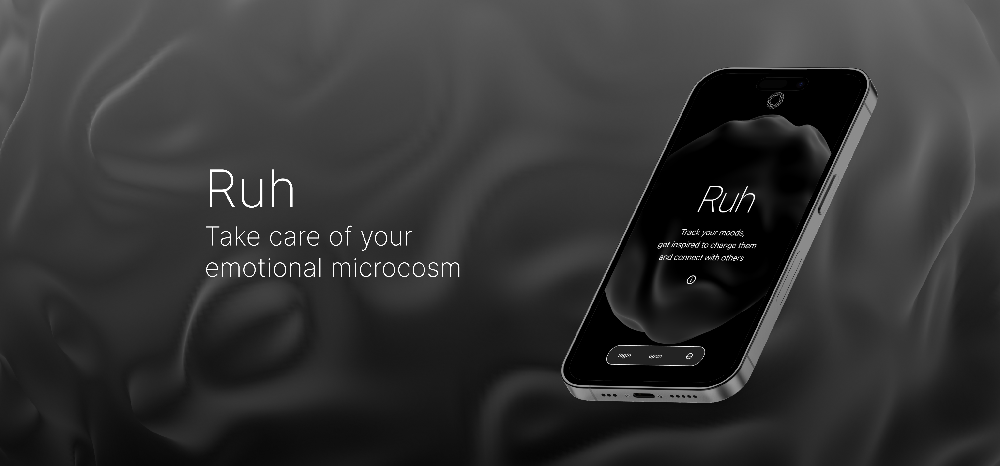
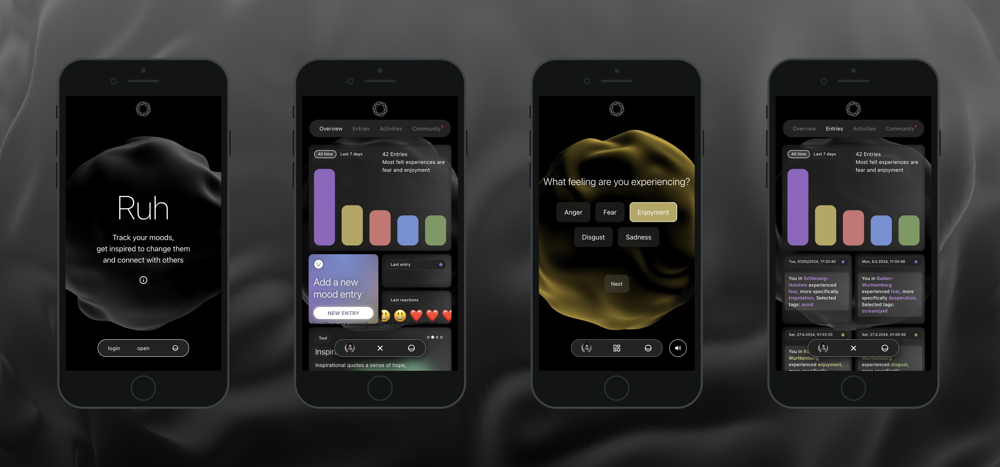

# Capstone Project: Ruh

With Ruh you can Track your moods, get inspired to change, maintain and share your state with the people you care about.

## Demo:

You can find the hosted version on Vercel: [Demo Version of Capstone Project](https://mood-diary-five.vercel.app/)

**Important:** This demo is optimized for mobile screen.

## Tech Stack

- React
- Next.js
- Styled Components
- NextAuth.js
- MongoDB
- Mongoose
- SWR
- Three.js
- React Three Fibre
- Framer Motion
- React H5 Audio Player

## Project Setup

- Clone this repository
- You need to add the following API keys to your `env.local` and Vercel:
  - GOOGLE_CLIENT_ID
  - GOOGLE_CLIENT_SECRET
  - X_RAPID_API_KEY
  - GITHUB_SECRET
  - GITHUB_ID
  - NEXTAUTH_URL
  - NEXTAUTH_SECRET
  - MONGODB_URI
- Install all dependencies with `$ npm install`
- Run app in dev mode with `$ npm run dev`
- Server: [http://localhost:3000/](http://localhost:3000/)
- Run tests via `$ npm run test`
